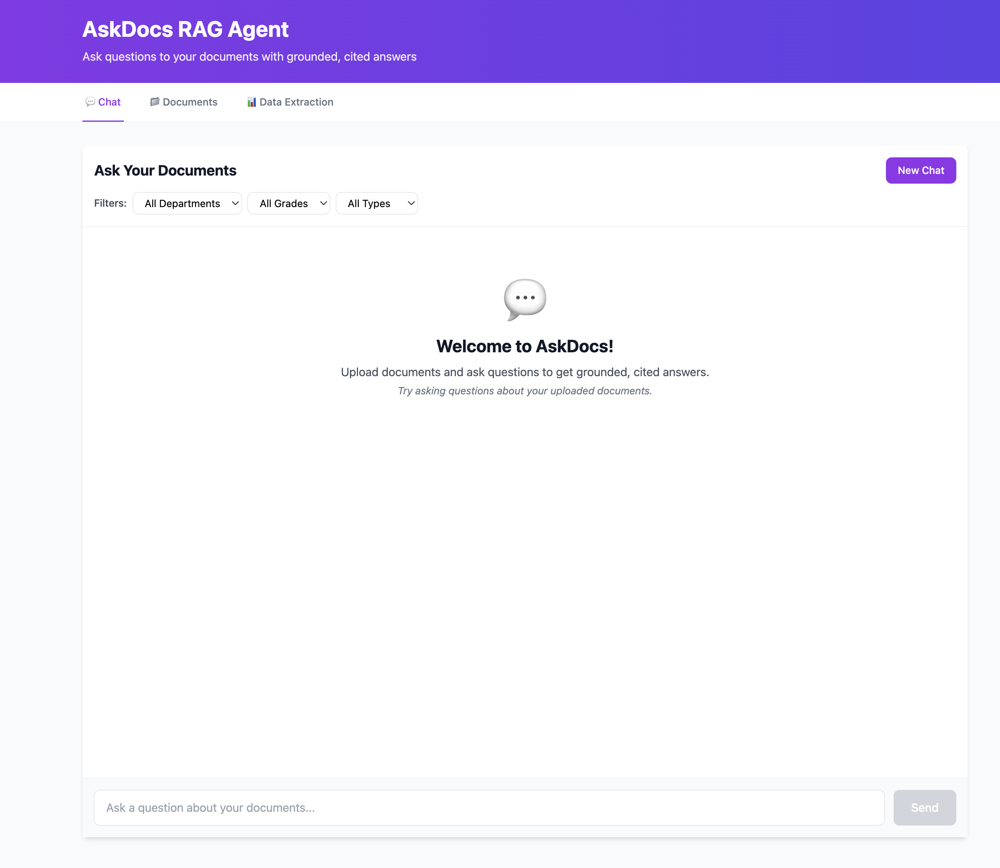
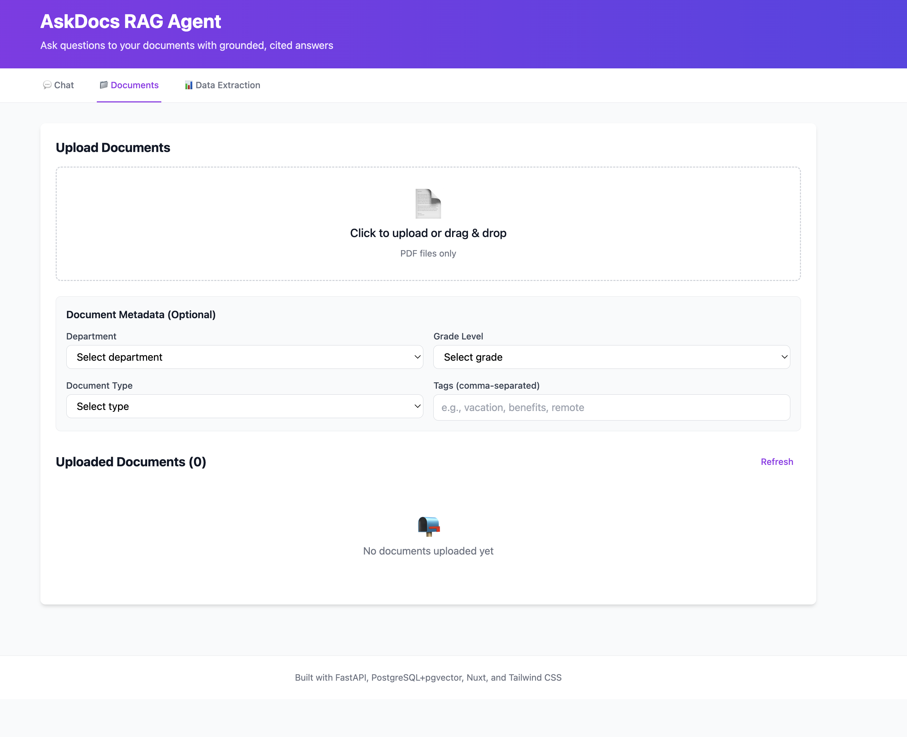
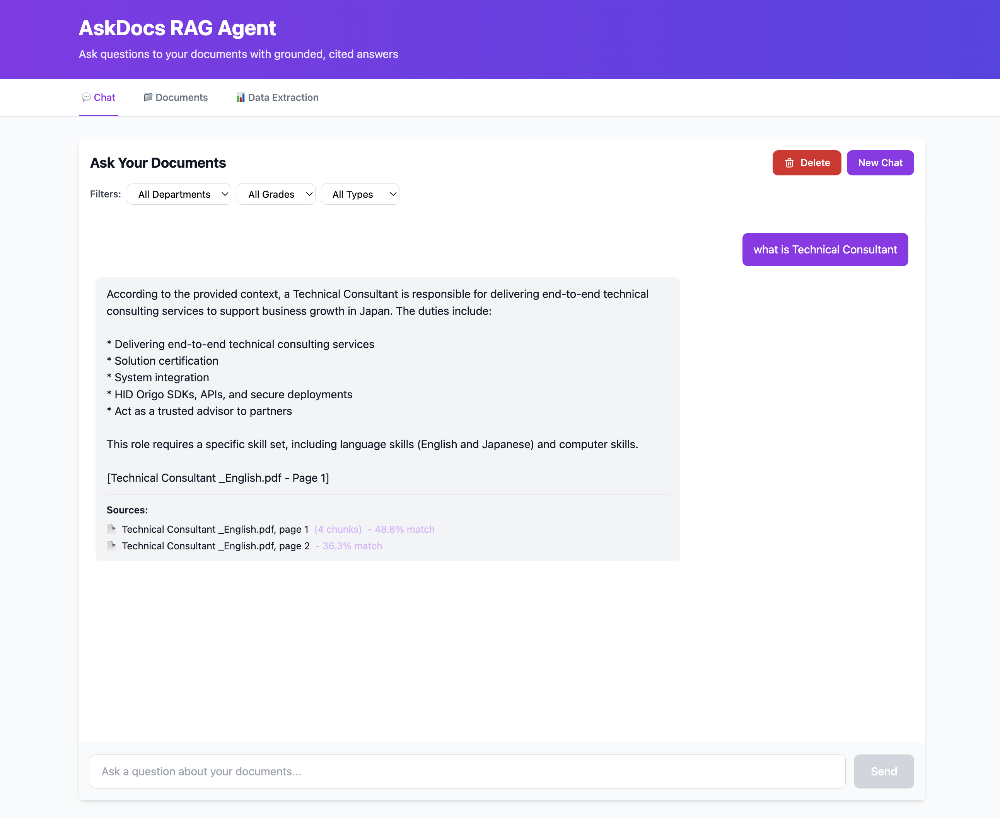
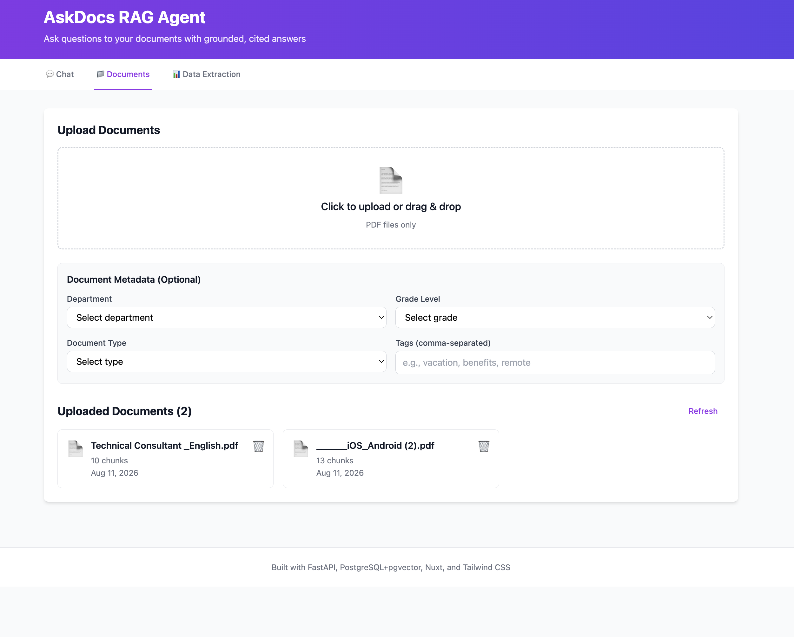
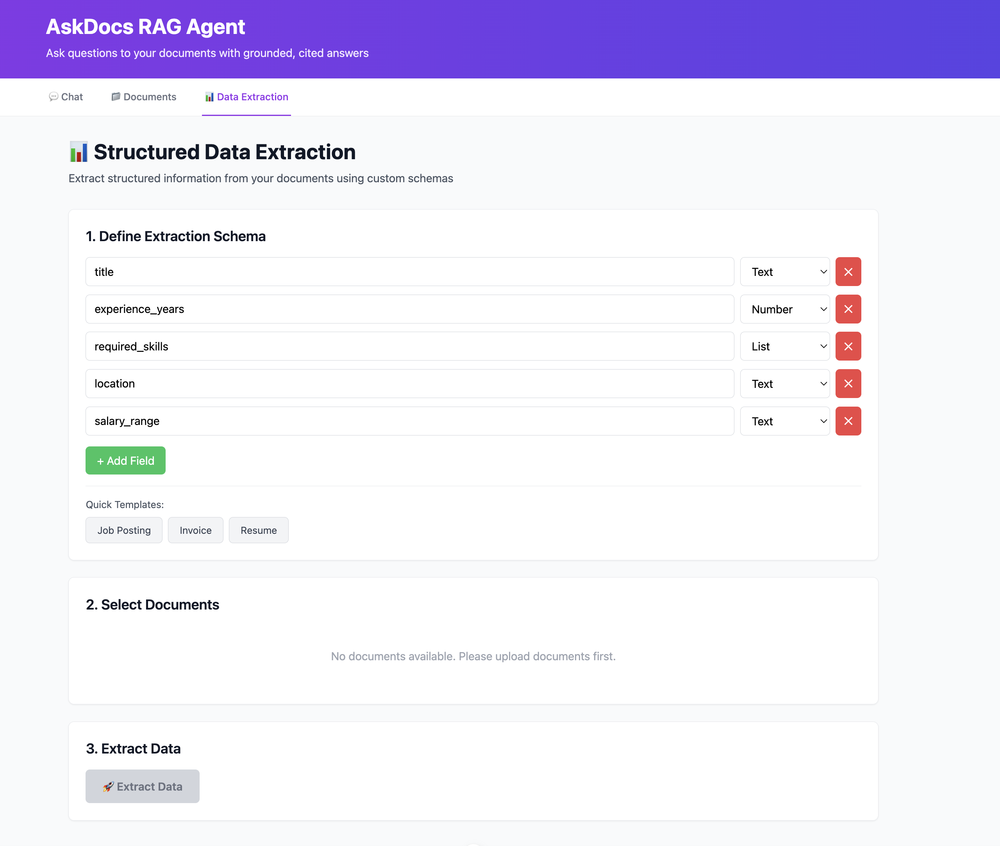
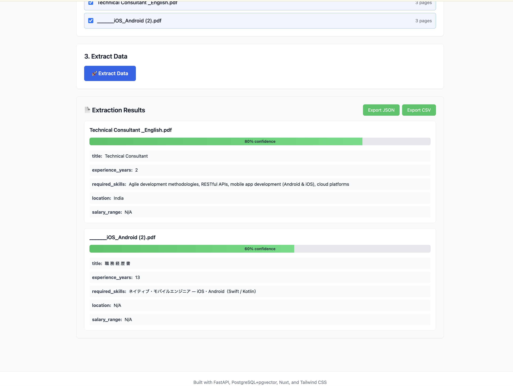

# askdocs-rag-agent

[](#testing)
[](#advanced-rag-features)

> Ask questions to your documents and get grounded, cited answers — a production-ready Document Q&A service built with FastAPI, PostgreSQL+pgvector, and advanced RAG techniques.

**Stack:** Python 3.12 · FastAPI · PostgreSQL + pgvector · Nuxt 4 · Tailwind CSS · Docker · Ollama (offline LLM)

**Latest Update:** Production-ready with 216/218 tests passing, HNSW indexing, duplicate detection, and API key authentication

## Description

A production-ready RAG (Retrieval-Augmented Generation) system that enables natural language Q&A over document collections with guaranteed citation accuracy. Built with enterprise-grade architecture featuring custom query routing, HNSW-indexed vector similarity search using pgvector, and multi-LLM support (Gemini, Ollama, Azure OpenAI).

**Key Differentiators:**
- **Grounded-or-refuse architecture** - Never hallucinates; returns "not_found" when answers aren't in documents
- **Citation tracking** - Every answer includes exact document and page references
- **Duplicate detection** - SHA-256 content hashing prevents duplicate uploads
- **HNSW indexing** - 10-100x faster vector search with PostgreSQL+pgvector
- **API key authentication** - All endpoints secured with X-API-Key header validation
- **Production-ready** - 216/218 tests passing (99.1%), cloud deployment docs (GCP/Azure)
- **Flexible LLM backend** - Swappable providers via adapter pattern (Gemini, Ollama offline, Azure OpenAI)

**Target Use Cases:** HR knowledge bases, customer support documentation, legal/compliance document search, IT helpdesk automation, sales enablement.

**Market Position:** Developer-first, self-hosted alternative to enterprise search products (Glean, Writer) — full data control and per-query costs instead of per-seat licensing. See docs/business for cost model.

---

## 📸 Demo Screenshots

### Chat Interface - Welcome Screen



Chat interface with filters (department, grade, type) and "New Chat" button. Clean welcome message guiding users to ask questions.

---

### Document Upload with Metadata



Upload PDF documents with optional metadata (department, grade level, document type, tags). Shows uploaded documents list with chunk counts.

---

### Chat Q&A with Citations



Ask questions and get answers with exact source citations (document name, page number, similarity scores). Delete button to remove individual messages or entire chat.

---

### Document Management



View all uploaded documents with chunk counts and upload dates. Delete documents as needed.

---

### Data Extraction - Schema Builder



Define custom extraction schemas with field names and types (Text, Number, List). Quick templates for common use cases (Job Posting, Invoice, Resume).

---

### Data Extraction - Results



Extracted structured data from documents with confidence scores. Export results as JSON or CSV.

---

📋 **Quick Demo:** [Getting Started](docs/demo/getting-started.md) | [Sample Questions](docs/demo/sample-questions.md) | [Ollama Local LLM](docs/demo/ollama-local-llm-demo.md)

> **Testing:** Works with [Ollama (free, 100% offline)](docs/demo/ollama-local-llm-demo.md) or [Gemini (cloud, best quality)](docs/core/configuration/CONFIGURATION.md).

---

## What It Does

Upload PDF documents → Ask questions in natural language → Get answers grounded in those documents with citations, or an honest "not found."

**No hallucinations.** Every answer either cites the exact source (document + page) or explicitly says the information doesn't exist in your documents.

**Example:**
```
Q: "What is the refund policy?"
A: "Refunds are processed within 14 days of purchase."
   Sources: [terms.pdf, page 7]

Q: "What's the weather today?"
A: "not_found - This question cannot be answered from the uploaded documents."
```

---

## Why Build This?

**The Problem:**
- Organizations have thousands of policy documents, manuals, handbooks
- Employees and customers waste hours searching for answers
- Generic AI chat tools hallucinate facts about your specific policies

**The Solution:**
- **Grounded answers only** - responses use retrieved document chunks, with confidence thresholds
- **Persistent knowledge base** - upload once, query forever (unlike ChatGPT's per-conversation uploads)
- **API-first** - integrate into Slack, web apps, customer support tools
- **Production-style** - typed code, tests, CI/CD, cloud deployment paths

**What makes this different from ChatGPT/Claude?**
See [Why Not Just Use ChatGPT?](docs/getting-started/WHY.md) for detailed comparison.

---

## Key Features

**Currently Working:**
- **Grounded Q&A** - Answers only from retrieved chunks, with `[doc, page]` citations
- **Honest refusal** - Returns "not_found" if confidence is too low (no guessing)
- **Query routing** - Classifies queries: answer / clarify / refuse based on confidence
- **Duplicate detection** - SHA-256 hashing prevents uploading same document twice
- **Two-stage retrieval** - Vector search (30 candidates) → Cross-encoder reranking (top 5)
- **HNSW indexing** - Fast vector similarity search (10-100x speedup)
- **API key authentication** - Secure endpoints with X-API-Key header
- **Swappable LLM** - Gemini, Ollama (offline), Azure OpenAI via adapter pattern
- **pgvector** - Vector embeddings in PostgreSQL (no separate vector DB)
- **Web UI** - Nuxt 4 interface for chat, document management, data extraction

**Will be implemented later:**
- Slack Bot integration
- Structured data extraction backend endpoint (UI exists)
- Multi-turn chat sessions API (database models exist)
- MCP integration for Claude Desktop

---

## Quick Start (Local)

**Prerequisites:**
- Docker & Docker Compose
- LLM provider (pick one):
  - **Gemini API** (free tier) - best quality
  - **Ollama** (local) - 100% offline, zero cost

**Run Backend API:**
```bash
git clone https://github.com/dinkar1708/askdocs-rag-agent.git
cd askdocs-rag-agent

# Configure LLM provider
cp .env.example .env
# Edit .env: set LLM_PROVIDER=gemini and add your GEMINI_API_KEY
# OR set LLM_PROVIDER=ollama for fully offline mode

# Start backend services
docker compose up --build

# API available at http://localhost:8000
# Swagger UI at http://localhost:8000/docs
```

**Run Web UI (optional):**
```bash
cd web-ui
npm install
npm run dev

# Web UI available at http://localhost:3000
```

**Note:** Slack bot integration is documented but not yet implemented. See [Slack Integration Guide](docs/features/13-slack-integration.md) for the planned implementation.

**Test the service:**
1. **Upload a document** - `POST /documents` with a PDF file
2. **Ask a question** - `POST /ask` with `{"question": "what is X?"}`
3. **Verify grounding** - Check the `sources` array in the response
4. **Try the Web UI** - Open http://localhost:3000

**Try the demo with sample data:**
```bash
# Upload sample company policy document
curl -X POST http://localhost:8000/documents/ \
  -H "X-API-Key: test-api-key-not-for-production" \
  -F "file=@app/samples/company_policy.pdf"

# Ask a test question
curl -X POST http://localhost:8000/ask/ \
  -H "Content-Type: application/json" \
  -H "X-API-Key: test-api-key-not-for-production" \
  -d '{"question": "How many vacation days do employees get?"}'

# Expected: "15 days of paid vacation per year" with citations
```

**Note:** All API endpoints require `X-API-Key` header for authentication.

📋 **Quick Demo:** See [Getting Started Guide](docs/demo/getting-started.md) for copy-paste questions with expected answers.

**Verify it works:**
```bash
# Run tests
docker compose exec api pytest

# Check test results
# Expected: 216/218 tests passing (99.1%)
```

**Note:** Evaluation harness (retrieval quality metrics) will be implemented later.

See [Local Development Guide](docs/LOCAL_DEVELOPMENT.md) for detailed setup.

---

## Testing

**Total: 240 tests - 216/218 backend passing (99.1%), 24 E2E tests**

- **216/218 Unit/Integration Tests** (Backend)
  - API endpoints (health, documents, Q&A)
  - RAG retrieval & reranking
  - LLM adapters (Gemini, Ollama, Azure OpenAI, Mock)
  - Document ingestion & chunking
  - Database operations
  - Query routing

- **24 End-to-End Tests** (Frontend + Backend)
  - Document upload & management
  - Question answering with citations
  - Multi-turn conversations (frontend only, API pending)
  - Source citation verification
  - Data extraction UI (backend endpoint pending)

**Run Tests:**
```bash
# Backend tests (pytest)
docker compose exec api pytest                    # All tests
docker compose exec api pytest app/tests/api/     # API tests only
docker compose exec api pytest -v                 # Verbose output

# E2E tests (Playwright)
cd web-ui
./run-e2e-tests.sh           # Run with mock LLM (fast, for CI/CD)
./run-e2e-with-ollama.sh     # Run with Ollama (real LLM, slower)
npm run test:e2e:ui          # Interactive mode (debug tests)
```

**Test Isolation:**
- E2E tests run on isolated ports (8001/3001) - won't affect development server (8000/3000)
- Separate test database on port 5433
- Mock LLM provider for fast, deterministic tests

See [Testing Guide](docs/testing/) for details.

---

## How It Works

**Ingestion Pipeline:**
```
PDF → Extract text (with page numbers) → Chunk (512 tokens, 128 overlap)
    → Embed (sentence-transformers) → Store (PostgreSQL + pgvector)
```

**Query Pipeline:**
```
Question → Embed → Vector search (top-k chunks) → LangGraph router
    ├─ High confidence → Generate answer + citations
    ├─ Ambiguous → Ask for clarification
    └─ Low confidence → Return "not_found"
```

**Key Design Decisions:**
- **Grounded-or-refuse** - Trust is the product; never improvise answers
- **LLM adapter pattern** - Cloud/model choice is config, not code change
- **pgvector in PostgreSQL** - Single database for relational + vector data
- **MCP-first** - API endpoints also exposed as AI assistant tools

See [Architecture Guide](docs/core/architecture/ARCHITECTURE.md) for deep dive.

---

## Project Structure

```
askdocs-rag-agent/
├── app/                   # Backend (Python/FastAPI)
│   ├── api/               # FastAPI routes
│   │   ├── documents.py   # Document upload endpoints
│   │   ├── questions.py   # Q&A endpoints
│   │   ├── slack.py       # Slack webhook endpoints
│   │   └── ...
│   ├── services/          # Business logic
│   │   ├── slack_bot.py   # Slack bot service
│   │   ├── retriever.py   # RAG retrieval
│   │   └── ...
│   ├── ingest/            # PDF extraction, chunking, embedding
│   ├── graph/             # LangGraph query router
│   ├── llm/               # Provider adapters (Gemini/Ollama/Azure)
│   ├── mcp/               # MCP server
│   ├── db/                # SQLAlchemy models, pgvector setup
│   ├── core/              # Config, logging
│   └── tests/             # pytest suites with auto-generated API docs
├── web-ui/                # Frontend (Nuxt 4/Vue/Tailwind)
│   ├── app/               # Vue components and pages
│   ├── composables/       # Vue composables and API services
│   ├── public/            # Static assets
│   └── nuxt.config.ts     # Nuxt configuration
├── docs/
│   ├── testing/
│   │   └── api-results/   # Auto-generated API request/response examples
│   ├── core/              # Architecture, deployment guides
│   └── interfaces/        # API, Web UI, Slack bot docs
├── samples/               # Sample PDFs for testing
└── docker-compose.yml
```

---

## Deployment

**GCP (Primary):**
- Cloud Run (stateless API, scales to zero)
- Cloud SQL (PostgreSQL + pgvector)
- Gemini API / Vertex AI

See [Deployment Guide](docs/core/deployment/DEPLOYMENT.md) for step-by-step.

**Azure (Supported):**
- Azure Container Apps
- Azure Database for PostgreSQL Flexible Server
- Azure OpenAI

Brief setup: [docs/core/deployment/AZURE.md](docs/core/deployment/AZURE.md)

---

## Documentation

**All documentation is in the [`/docs`](docs/) folder.**

| Document | Description |
|---|---|
| [Documentation Index](docs/README.md) | Start here - Complete navigation guide |
| [Architecture](docs/core/architecture/ARCHITECTURE.md) | System design, data flow, key decisions |
| [Development](docs/development/DEVELOPMENT.md) | Developer quick reference |
| [Local Setup](docs/getting-started/LOCAL_DEVELOPMENT.md) | Detailed setup, testing, debugging |
| [API Guide](docs/interfaces/api/) | API integration guide with examples |
| [Web UI](docs/interfaces/web-ui/) | Browser interface for end users |
| [Slack Bot](docs/features/13-slack-integration.md) | Slack integration setup & usage |
| [Configuration](docs/core/configuration/CONFIGURATION.md) | Environment variables, tuning |
| [Deployment](docs/core/deployment/) | GCP (detailed), Azure (brief) |
| [Features](docs/features/) | User-focused feature docs |
| [Security](docs/core/security/) | Security guidelines & checklist |
| [Business](docs/business/) | Sales materials, pricing, ROI |
| [Why This?](docs/getting-started/WHY.md) | vs ChatGPT/Claude |

---

## Roadmap

- [ ] Core RAG API (ingest, ask, grounded answers)
- [ ] LangGraph router (answer/clarify/refuse)
- [ ] Multi-turn chat with memory
- [ ] MCP server tools
- [ ] Evaluation harness
- [ ] Web UI (Nuxt 4 + Tailwind CSS)
- [ ] User authentication & authorization
- [ ] GCP Cloud Run deployment + CI/CD
- [ ] Azure Container Apps deployment
- [ ] Multi-tenant support
- [ ] Japanese document support

---

## Contributing

Contributions welcome! See [CONTRIBUTING.md](docs/CONTRIBUTING.md)

---

## License

MIT License - see [LICENSE](LICENSE)

---

## Author

**Dinakar Maurya** — Solution Architect / AI Engineer, Tokyo

- GitHub: [@dinkar1708](https://github.com/dinkar1708)
- Medium: [@dinkar1708](https://medium.com/@dinkar1708)
- LinkedIn: [in/dinkar1708](https://www.linkedin.com/in/dinkar1708)

---

**Questions?** Open an issue on [GitHub](https://github.com/dinkar1708/askdocs-rag-agent).
