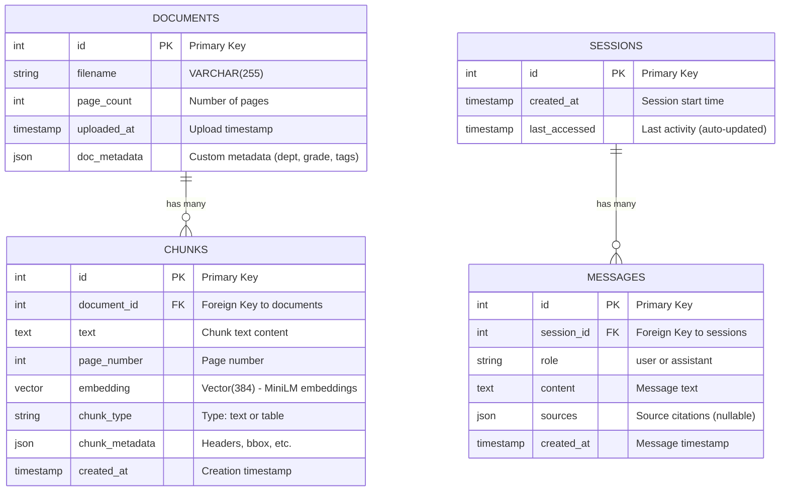

# Database Schema Design

High-level database design for askdocs-rag-agent.

> **📊 Auto-generated diagrams:** Run `python scripts/docs/generate_schema.py` to regenerate schema diagrams from SQLAlchemy models.

---

## Overview

PostgreSQL database with pgvector extension for vector similarity search.

---

## Visual Schema Diagram



**Also available as:**
- PNG diagram: [schema.png](./schema.png)
- Detailed text: [schema_details.txt](./schema_details.txt)

---

## Tables

### 1. documents

Stores uploaded PDF metadata.

**Current Fields:**
- `id` - Integer primary key (auto-increment)
- `filename` - VARCHAR(255), original filename
- `page_count` - Integer, number of pages
- `uploaded_at` - TIMESTAMP, upload timestamp (defaults to UTC now)
- `doc_metadata` - JSON, custom metadata (department, grade, document type, tags, etc.) ✅ **IMPLEMENTED**

**Purpose:** Track which documents exist in the system with flexible metadata support.

**Planned additions:**
- `tenant_id` - For multi-tenant isolation
- `file_hash` - SHA256 hash for deduplication

---

### 2. chunks

Stores document text chunks with embeddings.

**Current Fields:**
- `id` - Integer primary key (auto-increment)
- `document_id` - Integer, foreign key to documents.id (CASCADE DELETE)
- `text` - TEXT, the actual text content
- `page_number` - Integer, which page this chunk came from
- `embedding` - VECTOR(384), embedding from all-MiniLM-L6-v2
- `chunk_type` - VARCHAR(50), content type ('text' or 'table') ✅ **IMPLEMENTED**
- `chunk_metadata` - JSON, additional metadata (headers, bbox, etc.) ✅ **IMPLEMENTED**
- `created_at` - TIMESTAMP, when chunk was created

**Purpose:** Store searchable text chunks with vector embeddings, supporting both text and table content.

**Indexes:**
- Primary key index on `id`
- B-tree index on `id` (ix_chunks_id)
- Foreign key constraint on `document_id`
- **Note:** Vector index (IVFFlat or HNSW) should be added in production for performance

**Planned additions for advanced features:**
- `chunk_index` - Integer - Order within document (0, 1, 2...)
- `parent_chunk_id` - Integer - For hierarchical chunking
- `bm25_vector` - For hybrid search (semantic + keyword)
- Vector similarity index (IVFFlat or HNSW) on `embedding` for faster searches

---

### 3. sessions

Stores conversation sessions for multi-turn chat.

**Current Fields:**
- `id` - Integer primary key (auto-increment)
- `created_at` - TIMESTAMP, session start time
- `last_accessed` - TIMESTAMP, last message time (auto-updates)

**Purpose:** Group related messages into conversations.

**Relationship:** Has many messages (see below)

---

### 4. messages

Stores individual chat messages within sessions.

**Current Fields:**
- `id` - Integer primary key (auto-increment)
- `session_id` - Integer, foreign key to sessions.id
- `role` - VARCHAR(50), 'user' or 'assistant'
- `content` - TEXT, message text
- `sources` - JSON, source citations for assistant messages (nullable)
- `created_at` - TIMESTAMP, when message was created

**Purpose:** Store conversation history with citations.

**Planned additions:**
- `retrieval_scores` - JSON - Store chunk IDs and similarity scores
- `reranking_scores` - JSON - Store reranked scores for analysis
- `feedback` - ENUM ('helpful', 'not_helpful') - User feedback on answers

---

## Relationships

```
documents (1) ──< (many) chunks
    │
    └─ One document has many chunks (CASCADE DELETE)

sessions (1) ──< (many) messages
    │
    └─ One session has many messages (CASCADE DELETE)

Future: chunks may have parent-child relationships for hierarchical chunking
```

---

## Multi-Tenant Design (Optional)

If supporting multiple tenants:

**Add to documents table:**
- `tenant_id` - Isolate documents per customer

**Query pattern:**
```
All queries filter by tenant_id:
WHERE tenant_id = :current_tenant
```

**Benefit:** Single database serves multiple customers with data isolation.

---

## Vector Search Strategy

### Embedding Dimensions
- **sentence-transformers:** 384 dimensions
- **OpenAI ada-002:** 1536 dimensions
- **Configurable** via environment variable

### Similarity Metric
- **Cosine similarity** (standard for normalized embeddings)

### Index Type
- **ivfflat** - Good for <1M vectors
- **hnsw** - Better for >1M vectors (faster but more memory)

---

## Storage Estimates

### Per Document
- **Metadata:** ~1KB
- **Chunks (avg 100 per doc):** ~50KB text + ~150KB embeddings
- **Total per doc:** ~200KB

### For 1000 Documents
- **Total storage:** ~200MB

### For 100K Documents
- **Total storage:** ~20GB

---

## Backup & Recovery

**Backup frequency:** Daily
**Retention:** 30 days
**Method:** Cloud SQL automated backups (GCP) or Azure Database backups

---

## Migration Strategy

Use **Alembic** for schema migrations:
- Track schema changes in version control
- Apply migrations on deployment
- Rollback capability

---

## Key Design Decisions

### Why pgvector in PostgreSQL?
- ✅ Single database (simpler than separate vector DB)
- ✅ ACID transactions
- ✅ Foreign key constraints (data integrity)
- ✅ Sufficient performance for <1M documents
- ✅ Easy migration to dedicated vector DB if needed

### Why JSON for metadata/history?
- ✅ Flexible schema (add fields without migrations)
- ✅ PostgreSQL has excellent JSON support
- ✅ Easy to query and index

### Why Integer IDs currently?
- ✅ Simpler implementation for MVP
- ✅ Better PostgreSQL performance for joins
- ✅ Smaller index size
- ⚠️ May migrate to UUIDs for multi-tenant version

---

## Next Steps

**Implementation:**
1. Create SQLAlchemy models based on this schema
2. Generate initial Alembic migration
3. Test locally with docker-compose

**Will be updated** after actual implementation with exact column types and constraints.
