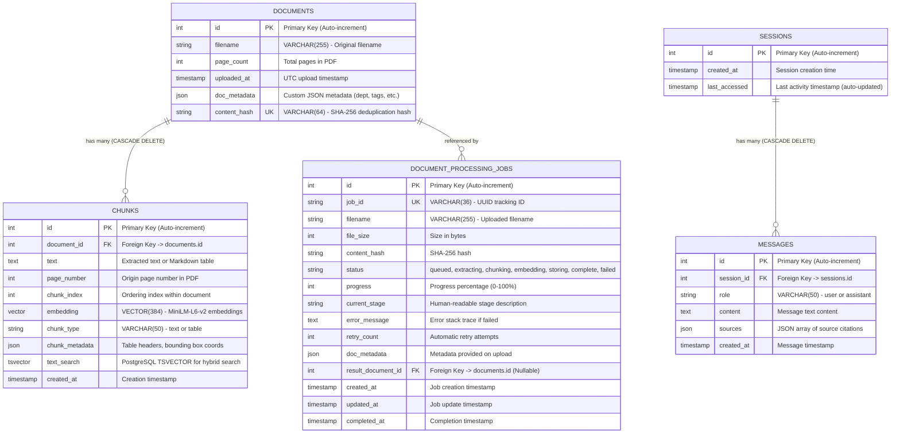

# Database Schema Design - AskDocs RAG Agent

Comprehensive database architecture for AskDocs, built with PostgreSQL 16 and the pgvector extension.

Database Model Source: [`app/db/models.py`](file:///Users/dinakarmaurya/Documents/Personal/askdocs-rag-agent/app/db/models.py)  
Repository: [github.com/dinkar1708/askdocs-rag-agent](https://github.com/dinkar1708/askdocs-rag-agent)

---

## 1. Visual Entity-Relationship (ER) Diagram (Current Architecture)

---

## 2. Table Specifications and Indexes

### 1. documents
Stores document metadata and duplicate detection hashes.
- Primary Key: id
- Unique Constraints: content_hash (prevents re-uploading identical PDF files)
- Code Reference: [`Document` model in `app/db/models.py`](file:///Users/dinakarmaurya/Documents/Personal/askdocs-rag-agent/app/db/models.py#L26-L41)

### 2. chunks
Vector store housing 384-dimensional dense vectors and full-text TSVector data.
- Primary Key: id
- Foreign Key: document_id -> documents.id (with ON DELETE CASCADE)
- Vector Index: HNSW (embedding vector_cosine_ops) with parameters (m = 16, ef_construction = 64) for sub-10ms similarity search.
- Full-Text Index: GIN(text_search) for fast BM25 keyword matching in hybrid search.
- Code Reference: [`Chunk` model in `app/db/models.py`](file:///Users/dinakarmaurya/Documents/Personal/askdocs-rag-agent/app/db/models.py#L43-L62)

### 3. sessions and messages
Maintains conversational history for multi-turn chat sessions.
- Foreign Key: messages.session_id -> sessions.id (ON DELETE CASCADE)
- Source Citations: Stored as structured JSON containing chunk_id, filename, page_number, similarity_score, reranking_score.
- Code Reference: [`Session` and `Message` models in `app/db/models.py`](file:///Users/dinakarmaurya/Documents/Personal/askdocs-rag-agent/app/db/models.py#L64-L93)

### 4. document_processing_jobs
Tracks asynchronous background processing through the LangGraph ingestion pipeline.
- Primary Key: id, Unique Key: job_id (UUID)
- Status Enum: queued, extracting, chunking, embedding, storing, complete, failed
- Progress: Integer 0 to 100 polled by Web UI during async file upload.
- Code Reference: [`DocumentProcessingJob` in `app/db/models.py`](file:///Users/dinakarmaurya/Documents/Personal/askdocs-rag-agent/app/db/models.py#L95-L119)

---

## 3. Future Schema Roadmap (TODO Items)

> [!NOTE]
> TODO (Planned for Future Release):
> - Multi-Tenancy: Adding tenant_id INT NOT NULL and compound indexes (idx_chunks_tenant_embedding) to enable multi-tenant workspace isolation.
> - User and Auth Models: Adding users and api_tokens tables for JWT/OAuth authentication and per-user permission policies.
> - Evaluations and Ground Truth: Adding eval_queries and eval_metrics tables to record automated MRR and citation precision benchmarks.
