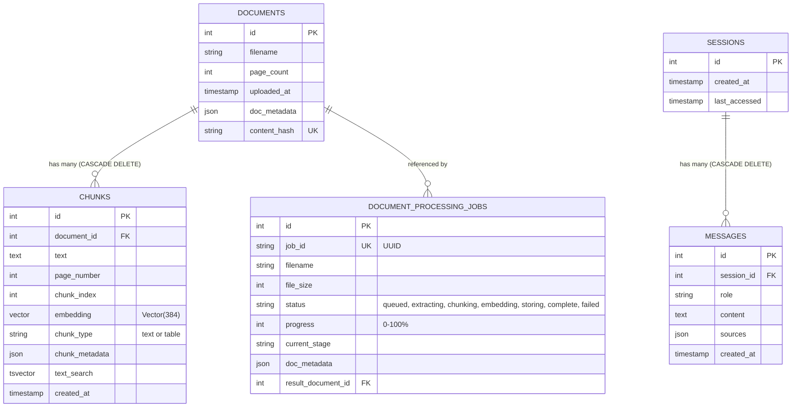

# Intermediate Level: Vector Database and pgvector Guide

---

## 1. Relational and Vector Schema Overview

### Q1: What is the complete database schema implemented in AskDocs?
**Answer:**
Defined in [`app/db/models.py`](file:///Users/dinakarmaurya/Documents/Personal/askdocs-rag-agent/app/db/models.py) in the [dinkar1708/askdocs-rag-agent](https://github.com/dinkar1708/askdocs-rag-agent) repository, the PostgreSQL 16 schema connects relational models with pgvector:



---

## 2. Models Implementation in SQLAlchemy

```python
# app/db/models.py
from sqlalchemy import Column, Integer, String, Text, DateTime, ForeignKey, JSON
from sqlalchemy.orm import declarative_base, relationship
from pgvector.sqlalchemy import Vector
from datetime import datetime

Base = declarative_base()

class Document(Base):
    __tablename__ = "documents"
    id = Column(Integer, primary_key=True, index=True)
    filename = Column(String(255), nullable=False)
    page_count = Column(Integer, default=1)
    uploaded_at = Column(DateTime, default=datetime.utcnow)
    doc_metadata = Column(JSON, default=dict)
    content_hash = Column(String(64), unique=True, nullable=True)

    chunks = relationship("Chunk", back_populates="document", cascade="all, delete-orphan")


class Chunk(Base):
    __tablename__ = "chunks"
    id = Column(Integer, primary_key=True, index=True)
    document_id = Column(Integer, ForeignKey("documents.id", ondelete="CASCADE"), nullable=False)
    text = Column(Text, nullable=False)
    page_number = Column(Integer, nullable=False)
    chunk_index = Column(Integer, nullable=False, default=0)
    embedding = Column(Vector(384), nullable=True)
    chunk_type = Column(String(50), default="text")
    chunk_metadata = Column(JSON, nullable=True)
    created_at = Column(DateTime, default=datetime.utcnow)

    document = relationship("Document", back_populates="chunks")
```

---

## 3. Future Database Roadmap (TODOs)

> [!NOTE]
> TODO (Planned for Future Release):
> - Multi-Tenancy: Adding tenant_id to all tables and creating composite vector indexes (tenant_id, embedding).
> - User Authentication: Creating users and refresh_tokens tables for enterprise Single Sign-On (SSO).
